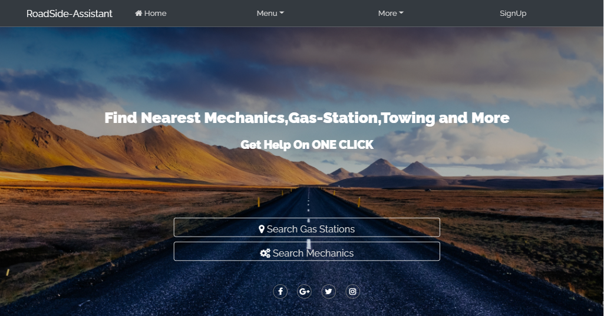
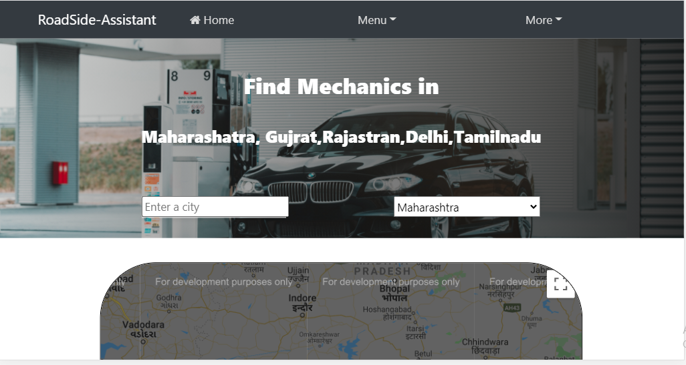

# RoadSide-Assistance FInder

### Introduction
RoadSide Assistance Finder  is a Website which helps to find the nearby Gas-Station and Mechanics as per User's Location.
Technology used are HTML5,CSS3,Bootstrap,JavaScript,PHP,MySQL, Google Map API.

RoadSide Assistant helps you to find nearest Mechanics, Petrol Pump on ONE CLICK . You just have to enter the location (eg.name of city) and within a second we will provide you nearest service center with detail information.

### Prerequisites
* Google Map API 'KEY'.
* Any text editor(Atom, Bracket, Sublime recommended).

### Get Started

* Clone the Repo
* replace  Placeholder Map API key with your API key in index.html page.

### Technology Stack
* HTML5
* CSS3
* JavaScript
* Bootstrap
* Google Map API
* Geolocation API

### Built With
* Bracket 
* Git
* Browser

### Authors
* Vishal Mane
* Jenis Lawrence
* Neil Gonsalvies
